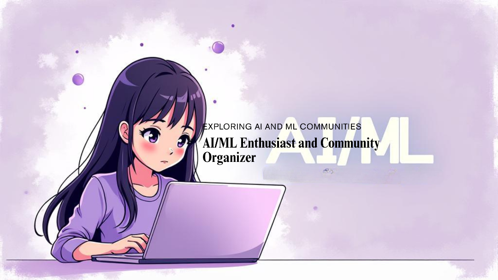

<!-- Banner -->

  

  

<!-- Banner (Option 2: quick auto banner—remove if you use your own image) -->
<!--

  

-->

I’m a final-year **CS student** who loves building **AI/ML** things that actually ship 🌸.  
💜 My toolkit blends **Python + TensorFlow/PyTorch + scikit-learn** with **.NET/C#** and solid **database design** (SQL & NoSQL).  
I love exploring how data can transform into intelligent solutions 🌷.

### Find me around the web 🌍

- Sharing updates on **LinkedIn**: <a href="https://www.linkedin.com/in/rooha-tanveer-220476282/">linkedin.com/in/rooha-tanveer-220476282</a> 📌
- Thoughts & tiny wins on **X (Twitter)**: <a href="https://x.com/Rooha_Tanveer?t=fLi0THZiVy-Hcq-nSBiSlg&s=08">@Rooha_Tanveer</a> 🦄  
- Say hi via **email**: <a href="mailto:rooha9tanveer@gmail.com">rooha9tanveer@gmail.com</a> 💌

<!-- cute pastel buttons (optional) -->

  
  
  

## 🧰 Languages & Tools

  

## 📊 GitHub Stats

  
  

## 📈 Contribution Activity

## 📈 Profile Visitors Counter

  

  

